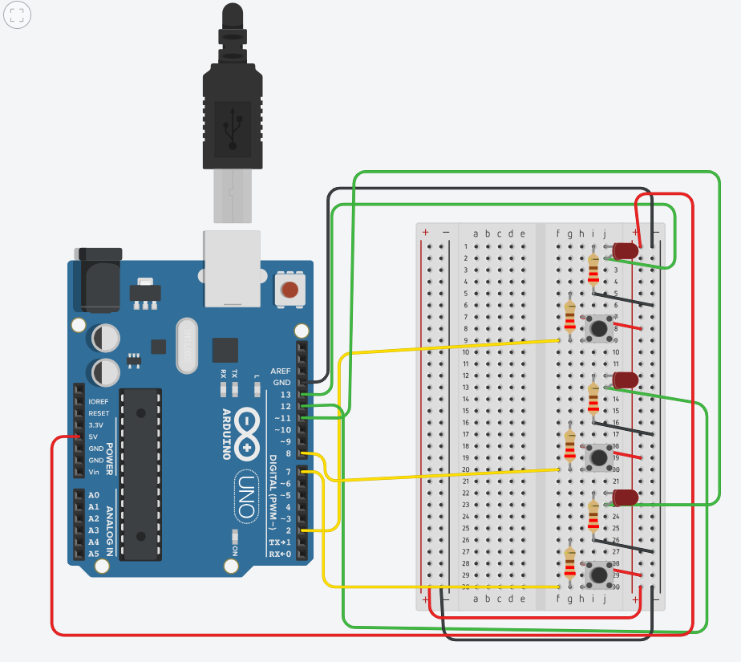

# LED Toggle with Buttons using Arduino

This project demonstrates how to toggle 3 individual LEDs using 3 push buttons connected to an Arduino UNO. Each button toggles its own LED ON or OFF.

##  Circuit Diagram

##  Components Used

- 1x Arduino UNO
- 3x LEDs (any color)
- 3x 220Ω resistors
- 3x Push buttons
- Breadboard and jumper wires

##  Wiring

 Pin    Connected to     

 D2     Button 1         
 D8     Button 2         
 D7     Button 3         
 D13    LED 1            
 D12    LED 2            
 D11    LED 3            

##  Code

See `LED_Toggle.ino` for full implementation.

##  License

MIT License
